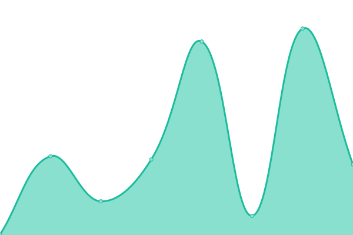

# [📈 Live Status](https://drjoeycadieux.github.io/page3time): <!--live status--> **🟩 All systems operational**

This repository contains the open-source uptime monitor and status page for [Joey Cadieux](https://drjoeycadieux.github.io/page3time), powered by [Upptime](https://github.com/upptime/upptime).

With [Upptime](https://upptime.js.org), you can get your own unlimited and free uptime monitor and status page, powered entirely by a GitHub repository. We use [Issues](https://github.com/drjoeycadieux/page3time/issues) as incident reports, [Actions](https://github.com/drjoeycadieux/page3time/actions) as uptime monitors, and [Pages](https://drjoeycadieux.github.io/page3time) for the status page.

<!--start: status pages-->
<!-- This summary is generated by Upptime (https://github.com/upptime/upptime) -->
<!-- Do not edit this manually, your changes will be overwritten -->
<!-- prettier-ignore -->
| URL | Status | History | Response Time | Uptime |
| --- | ------ | ------- | ------------- | ------ |
|  [techtack-technologies](https://techtack-technologies.com/) | 🟩 Up | [techtack-technologies.yml](https://github.com/drjoeycadieux/page3time/commits/HEAD/history/techtack-technologies.yml) | 

 344ms
     
 | 

<a href="https://drjoeycadieux.github.io/page3time/history/techtack-technologies">100.00%</a>
    

|  [api3](https://api3.techtack-technologies.com/) | 🟩 Up | [api3.yml](https://github.com/drjoeycadieux/page3time/commits/HEAD/history/api3.yml) | 

 217ms
     
 | 

<a href="https://drjoeycadieux.github.io/page3time/history/api3">100.00%</a>
    

|  [portal3](https://portal3.techtack-technologies.com/) | 🟩 Up | [portal3.yml](https://github.com/drjoeycadieux/page3time/commits/HEAD/history/portal3.yml) | 

 159ms
     
 | 

<a href="https://drjoeycadieux.github.io/page3time/history/portal3">100.00%</a>
    

|  [services-interruption](https://services-interruption.techtack-technologies.com/) | 🟩 Up | [services-interruption.yml](https://github.com/drjoeycadieux/page3time/commits/HEAD/history/services-interruption.yml) | 

 183ms
     
 | 

<a href="https://drjoeycadieux.github.io/page3time/history/services-interruption">100.00%</a>
    

<!--end: status pages-->

[**Visit our status website →**](https://drjoeycadieux.github.io/page3time)

## 📄 License

- Powered by: [Upptime](https://github.com/upptime/upptime)
- Code: [MIT](./LICENSE) © [Joey Cadieux](https://drjoeycadieux.github.io/page3time)
- Data in the `./history` directory: [Open Database License](https://opendatacommons.org/licenses/odbl/1-0/)
